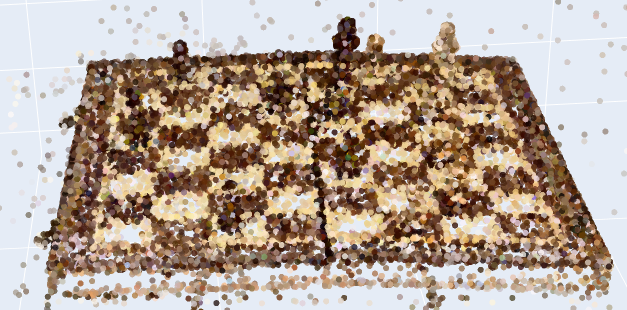

# 3DGS Simulation Asset Optimizer 

[](https://isocpp.org/)
[]()
[]()

A high-performance processing pipeline designed to parse, prune, and optimize raw 3D Gaussian Splatting (`.ply`) assets for large-scale Autonomous Driving (AV) simulation and log re-simulation engines.

## ⚠️ The Systems Bottleneck in AV Simulation
As the AV industry shifts from NeRF to explicit 3D Gaussian Splatting (3DGS) for high-fidelity sensor simulation, memory hierarchy becomes a critical bottleneck. A raw city-block `.ply` file generated via photogrammetry/SfM can easily contain millions of splats, consuming massive storage and GPU VRAM. 

This tool operates at the pre-processing stage (CPU/RAM bound). It implements heuristic pruning strategies to drastically reduce asset size and extracts Spherical Harmonics (SH) for backward compatibility with traditional LiDAR ray-casting engines.

---

## 🚀 Tool 1: Gaussian Pruner (`gaussian_pruner.py` / `gaussian_pruner.cpp`)
Reverses the underlying Logit representations (via Sigmoid function) to identify and surgically remove transparent "floater" noise generated by SfM artifacts, maintaining strict visual fidelity while saving VRAM.

### Performance Metrics (Chess Endgame Scene)
| Metric | Raw Asset (`.ply`) | Optimized Asset | Reduction |
| :--- | :--- | :--- | :--- |
| **File Size** | 161.62 MB | 99.78 MB | **38.26%** |
| **Gaussian Count** | 683,359 | 421,874 | **38.26%** |
| **VRAM Footprint** | 161.62 MB | 99.78 MB | **38.26%** |

*Architecture Note: The Python implementation utilizing Numpy's C-backend and Block Memory Mapping outperforms the generic C++ header-only parser (`happly`) in I/O bound operations (~0.5s vs ~2.5s), highlighting the importance of memory access patterns over raw language speed.*

---

## 🔍 Tool 2: SH Point Cloud Extractor (`sh_extractor.py`)
Extracts the 0th-order Direct Current (DC) components from the Spherical Harmonics matrix to reconstruct standard diffuse RGB values. This enables down-converting the complex 3DGS structure into a standard 3D point cloud for traditional physics engines and visual inspection.



---

## 🛠️ Quick Start (Codespaces Ready)

### Option A: Python Prototyping Environment
Run the setup script to automatically create a virtual environment and install dependencies:
```bash
# Set up virtual environment and install dependencies
chmod +x setup.sh
./setup.sh
source venv/bin/activate
```

**1. Run the Pruner:**
```bash
# Execute the opacity pruning script
cd python_prototype
python gaussian_pruner.py --input ../data/chess_raw.ply --output ../data/chess_optimized.ply --threshold 0.05
```

**2. Run the SH Extractor Visualization:**
```bash
# Generate interactive HTML point cloud
python sh_extractor.py --input ../data/chess_optimized.ply --output ../data/point_cloud_viz.html --max_points 50000
```

---

### Option B: C++ Production Build
For environments requiring strict native C++ integration, a compiled pipeline is provided using the `happly` library.

**1. Setup Dependencies:**
```bash
# Create required directories
mkdir -p cpp_core/include
mkdir -p cpp_core/src

# Download the header-only happly library
wget -O cpp_core/include/happly.h [https://raw.githubusercontent.com/nmwsharp/happly/master/happly.h](https://raw.githubusercontent.com/nmwsharp/happly/master/happly.h)
```

**2. Build the Project:**
```bash
# Configure and compile using CMake
cd cpp_core
mkdir -p build && cd build
cmake ..
make
```

**3. Run the Native Pruner:**
```bash
# Execute the compiled binary
./gaussian_pruner ../../data/chess_raw.ply ../../data/chess_optimized_cpp.ply 0.05
```
